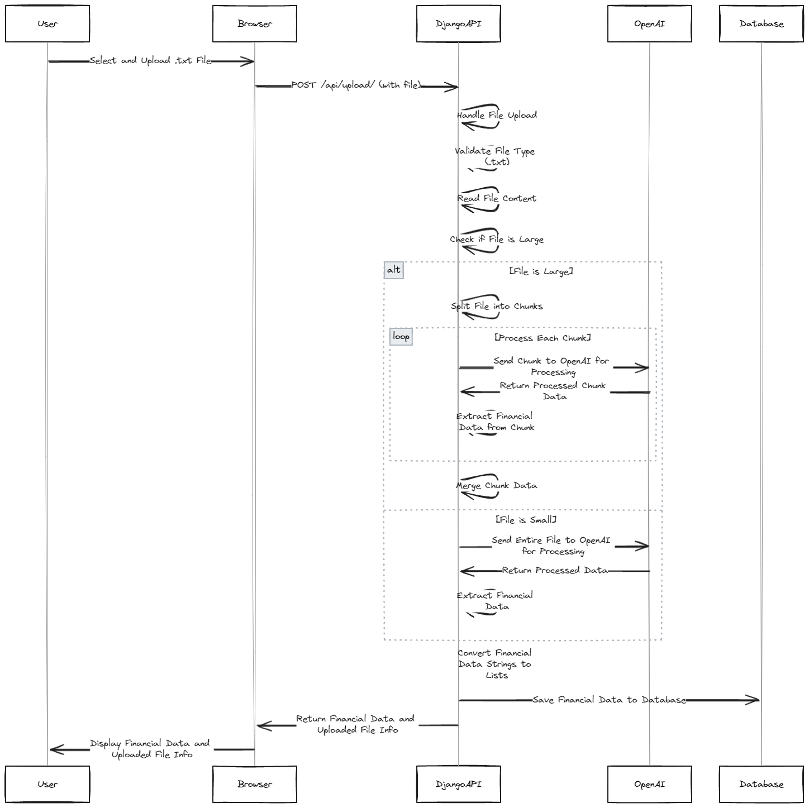

# Saturn AI Investment Details Extractor using Open AI

This Django application allows users to upload transcript files containing financial conversations. The application processes the uploaded transcripts, extracts financial information such as assets, expenditures, and income using the OpenAI model, and stores the extracted information in a database. The application also provides a REST API for uploading files and retrieving the extracted financial data.

## Features

- [x] Upload `.txt` files containing financial conversation transcripts.
- [x] Extracts financial information from the uploaded transcripts.
- [x] Handles large files by splitting them into manageable chunks while maintaining context.
- [x] Stores extracted financial data in a database.
- [x] Provides a REST API for file upload and data retrieval.
- [x] Displays financial data on the frontend.
- [x] Rate limiting the api
- [x] Test Coverage

## Prerequisites

- Python 3.8+
- Django 3.2+
- Node.js (for frontend dependencies if any)
- OpenAI API Key

## Application Architecture and Flow



## Optimizations

 **Enabled Chinking while maintainig no context loss**
 - instead of text splitting and suffer context loss while querying llms, the chunks are split between `[END OF TRANSCRIPT X][BEGIN TRANSCRIPT]` within the character limit. this makes sure there is no context loss

## Potential Optimisations

 **Polling Api**
- When the file is too large the request can take some time to process, but the fronted has timelimit of 2 minutes, so to avoid time out, A polling mechanism can be used to constantly ping for the status of the response this can reduce timeout errors

## Installation

1. **Clone the repository**:

   ```bash
   git clone https://github.com/alpha-titan/saturnai_investment_extractor.git
   cd saturnai_investment_extractor
    ```

2. **Setup the Virtual Env**:

   ```bash
    python3 -m venv venv
    source venv/bin/activate
    ```

3. **Install required modules**:

   ```bash
    pip install -r requirements.txt
    ```

4. **Setup the env variable**:

   ```bash
    OPENAI_API_KEY=your_openai_api_key
    ```

5. **Run Migrations**:

   ```bash
    python manage.py makemigrations
    python manage.py migrate
    ```

6. **Start the development server**:

   ```bash
    python manage.py runserver
    ```

## Usage

1. **Using Postman**:

   upload the transcript text file to the following endpoint as a `POST` Request

   ```bash
    http://127.0.0.1:8000/api/upload/
    ```
2. **Using Frontend**
    clone the frontend [repo](https://github.com/alpha-titan/saturnai_frontend.git)
    and follow the instruction
 
## Testing

1. **Run the below command**:

   ```bash
    python manage.py test api
    ```